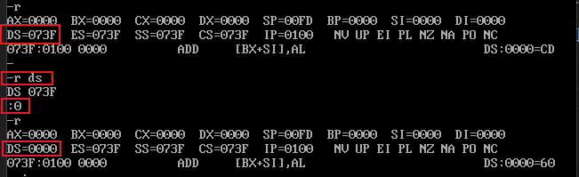

# debug.exe
## -u
- u :将某个内存地址开始的内存翻译成汇编指令


## -d
- d :显示某个内存地址处的数据内容


我们可以使用 **d 指令 + 地址** 来查看地址中的内容，如下图我们查看地址 21F00 内存单元中的内容：


（注意：寻址方式为 段地址 << 4 + 偏移地址）


## -r
- r :显示寄存器中的值
  


- r reg : r 后面跟一个寄存器，回车后输入一个值即可改变该寄存器的值，如下图：



## -e
- e :修改内存单元中的数据；如修改20000地址处内存单元中的值，如下：


## -t
- t :让CPU从CS:IP指向的内存地址处开始单步执行指令; 现有如下机器码对应的汇编指令：
```
机器码              汇编指令
b8 20 4e            mov ax, 4e20H
05 16 14            add ax, 1416H
bb 00 20            mov bx, 2000H
01 d8               add ax, ax
89 c3               mov bx, ax
01 d8               add ax, bx
b8 1a 00            mov ax, 001aH
bb 26 00            mov bx, 0026H
00 d8               add al, bl
00 dc               add ah, bl
00 c7               add bh, al
b4 00               mov ah, 0
00 d8               add al, bl
04 9c               add al, 9cH
```
把上述的机器码依次写入到内存地址20000处，如下图：


我们使用 -d 查看，那显示出来的就是普通数据，我们使用 -u 查看，那就会翻译成指令，我们先使用 -r 查看各寄存器中的值，如下图：


我们知道 CUP 把 CS:IP 指向的地址中的内容当成指令，所以我们需要修改 CS 和 IP 的值，使其指向 20000 的地址处，如下：


然后，现在我们再使用 -u 来查看我们刚刚使用 -d 修改的数据 被 翻译成指令是什么样子的，如下：


可以看到，翻译出的汇编指令与我们自己手动输入数据对应的汇编指令是一致的。我们使用 -t 指令可以让 CPU 从 cs:ip 指向的内存地址处开始执行指令。


## -a
- a :可以在指令内存地址处输入多条汇编指令


如下图，我们使用 -t 执行指令，观察 IP 值的变化，从 mov ax,1000 执行完后，IP的值增加3,说明 mvo ax,1000占三个字节，IP加3后指向了下一条指令即 mvo bx,1000


## -p
使用 debug 执行程序时，如 debug test.exe，当程序中有 int 指令时，需要使用 p 去执行这个 int 指令。

## -q
退出调试程序

## -g
-g指令可以理解为go，-g 后面加上地址偏移，意思为让程序直接执行到该地址偏移处，有点类似于gcc debug中的 run 命令，run到断点处。有如下汇编代码示例：

```c
assume cs:code

code segment
	mov ax,2000H
	mov ds,ax
	mov bx,1000H
	mov cx,16		;loop指令的循环次数
	mov dl,0
set_number:
	mov ds:[bx],dl
	inc dl
	inc bx
	loop set_number
	
	mov ax,4c00H	;程序返回
	int 21H
code ends
end
```
上述到代码目的是在内存2000:1000处依次写入"0123456789abcdef"字符，利用loop循环16次写入。我们在debug时，可以使用 -g 参数直接快速执行完 loop 指令，如下：


