# 0. 背景知识
x86为32位CPU，x64为64位CPU

## 汇编风格
目前对于复杂指令集(CISC)来说，有三种汇编风格：
```
MASM：  Windows系统下默认的汇编风格，文件后缀名.asm
NASM:   主要对MASM做了优化，比如大小写敏感，主要用于Linux平台, 文件后缀名.asm
ATT:    Linux系统下默认的汇编风格, 文件后缀名.s
```

区别如下：
```
寄存器赋值
NASM风格：
    mov eax, 1
ATT风格：
    mov $1, %eax
可见：ATT风格比较麻烦，立即数前必须加 $ 符号，寄存器前必须加 % 符号，且赋值左右方向相反。
```

还有很多区别，可自行百度。

# 1. 寄存器
## 数据寄存器
AX, BX, CX, DX 通用寄存器，也是数据寄存器，它们为16位寄存器，可分割为两个8位寄存器，如下：

```
AX = AH + AL
BX = BH + BL
CX = CH + CL
DX = DH + DL
```

- cx 可以当 loop 指令的循环限制次数

## 地址寄存器
我们知道8086CPU的地址线宽度为20位，但寄存器为16位，为了能达到20位的寻址宽度，8086CPU提供了以下寻址方式：

内存地址表示方式为 **段地址寄存器:偏移地址寄存器**；其寻址的计算方式为 **段地址<<4 + 偏移地址**。

表示段地址寄存器有如下几个：

```
ds  :访问数据(数据段)，ds指向的是数据保存在内存中的地址
es  :也可以当数据段
ss  :栈段，ss指向的内存地址为栈地址，通常与sp组合，如 ss:sp
cs  :访问指令(代码段)，cs指向的是指令保存在内存中的地址，通常与ip组合，如 cs:ip
```

表示偏移地址寄存器有如下几个：

```
sp (栈段的偏移寄存器，栈顶指针)
bp (这个可以理解为栈底指针，用于记录函数的调用路径)
si
di
ip (代码段的偏移寄存器)
bx (数据须的偏移寄存器)
```

## 标志位寄存器
这是一个很特殊的寄存器，没有指令能够直接操作这个寄存器，是CPU根据指令的执行结果，自动更新这个寄存器的内容。

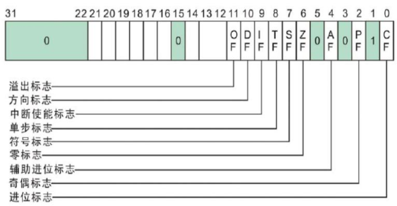

标志位|说明
|:--|:--|
CF|进位位；如果运算结果的最高位产生一个进位或者借位，则CF置1，否则CF清零
PF|奇偶位；如果运算结果低8位中"1"的个数为偶数时，则PF置1，否则PF清零
AF|辅助进位位；反应运算结果低四位产生进位或借位的情况
ZF|零值位；如果运算结果为零则ZF置1，否则清零
SF|符号位；如果运算结果为负，即一个数的最高位为1，则SF置1，否则SF清零
OF|溢出位；若运算结果超出补码表示范围(8位：-128\~127；16位：-32768\~32767)。若溢出OF置1，否则清零
TF|单步标志位；用于程序跟踪调试。当TF=1，CPU进入单步方式
IF|中断允许位，当IF=1时，CPU为开中断；当IF=0时，CPU为关中断
DF|方向位

标志位|真1|假0
|:--|:--|:--
OF|OV(overflow)|NV(not overflow)
SF|NG(negative)|PL(positive)
ZF|ZR(zero)|NZ(not zero)
PF|PE(even)|PO(odd)
CF|CY(carry yes)|NC(not carry)
DF|DN(down)|UP(up)

```
CF:Carry Flag
ZF:Zero Flag (mul/div不影响此标志)
PF:Parity Flag
SF:Sign Flag
OF:Overflow Flag
```

# CPU是如何区分指令和数据的？
其实，指令和数据在内存中是没有区别的； CPU 仅仅将 cs:ip 指向的内存单元中的内容当作指令。

# 指令的执行过程

1. CPU从CS:IP所指向的内存单元读取指令，存放到指令缓存器中
2. IP = IP + 所读指令的长度，从而指向下一条指令 (如果是跳转指令则IP需要在此基础上再加上位移)
3. 执行指令缓存器中的内容，然后回到步骤1

# 2.指令
## mov
```
mov ax,5        ; ax = 0x0005
mov bl,al       ; bl = al
mov al,ds:[8]    ; 把ds寄存器指向的内存地址偏移8字节的位置的内容赋值给al，方括号[]代表取该偏移里的内容
mov ds:[1],ax    ;

mov bx,2
mov ax,ds:[bx]  ;与 mov ax,ds:[2]等价
mov ax,ds:[bx+si]
mov ax,ds:[bx+di]
```

## add/sub/inc/dec
```
add ax,8        ; ax = ax + 0x08
sub ax,8        ; ax = ax - 0x08
inc ax          ; ax = ax + 1，它与 add ax,1 功能相同，但指令占用的字节数更少
dec ax          ; ax = ax - 1
```

## adc/sbb
带进位的加减法。 

## div
除法指令 div

```
除数：有8位和16位两种，放在寄存器或内存单元中
被除数：默认放在 AX 或者 AX 和 DX 中
       如果除数为8位，被除数则为16位，默认存放在AX中
       如果除数为16位，被除数则为32位，DX存放高16位，AX存放低16位
结果：如果除数8位，则AL存商，AH存余数
      如果除数为16位，则AX存商，DX存余数
```

例如：

```
mov ax,16   ;被除数（被除数一定是放在寄存器中）
mov bl,3    ;除数（除数可以在寄存器中，也可以在内存中，如ds:[0],使用byte ptr来控制宽度）
div bl      ; 16/3 商-al,余数-ah
```

下面是完整示例：

```
assume cs:code,ds:data,ss:stack

data segment
    db 3,0,16,0,0,0,0,0
data ends

stack segment stack
    dw 0,0,0,0
    dw 0,0,0,0
    dw 0,0,0,0
    dw 0,0,0,0
stack ends

code segment
start:
    mov ax,data
    mov ds,ax

    ;被除为16位，除数为8位
    mov ax,16
    div byte ptr ds:[0]     ;16/3 al存商 ah存余数

    ;被除数为32位，除数为16位
    mov ax,ds:[2]
    mov dx,ds:[4]
    mov bx,3
    div bx                  ;16/3 ax存商 dx存余数

    mov ax,4c00H    ;程序返回
    int 21H
code ends
end start
```

如何确定使用多少位除法，如 100001/100 因为被除数超过16位，所以需要采用16位除法，即除数100要当成16位；再如 1000/300，因为除数300超过8位，所以需要采用16位除法，即被除数1000要当成32位。

## mul
mul乘法指令：两个相数相乘。

两个数相乘，要么都是8位，要么都是16位。

```
如果是8位，一个数字默认存放在 al 中，另外一个数字存放在其它8位寄存器 或者 字节型内存单元中。
    al *(mul) 8位寄存器 = ax        ;结果存放在 ax 寄存器中
    al *(mul) byte ptr ds:[0] = ax

如果是16位，一个数字默认存放在 ax 中，另外一个数字存放在其它16位寄存器 或者 字型内存单元中。
    ax *(mul) 16位寄存器 = dx, ax
    ax *(mul) word ptr ds:[0] = dx, ax

格式：
mul 16位寄存器          ; ax = ax * 16位寄存器
mul word ptr ds:[0]    ; ax = ax * ds:[0]
```

```
乘法的结果存放位置：
    8位乘法，得到一个16位数值的结果，结果存放在 ax 中
    16位乘法，得到一个32位数值的结果，低16位存放在 ax 中，高 16 位存放在 dx 中
```

## and/or
```
and ax,bx       ;ax = ax&bx
or ax,bx        ;ax = ax|bx
```

## push/pop
push/pop指令只操作16位的数据，例如 push al 则是错误的指令。入栈和出栈都是把数据放入内存中或从内存中取出数据。

push 指令的执行步骤：先修改sp寄存器的数值，sp=sp-2, 然后将要保存的数据放到ss:sp所指向的栈地址处。(注意是满减栈，所以先sp-2,再存数据)

pop 指令的执行步骤：先取出ss:sp所指向的栈地址处内存中的数据，然后修改sp寄存器的数值，sp=sp+2

```
push        ; 入栈 
pop         ; 出栈
```

## pushf/popf
pushf 是将 标志寄存器内存 压栈；popf 是将内存中的数据恢复到 标志寄存器中。

示例，如下是清空 标志寄存器PSW :

```
mov ax,0
push ax
popf
```

## cmp/test
cmp

```
本质上做减法运算
cmp eax,10 等价于 sub eax,10
差别是 cmp 的运算结果只会更改 eflags 寄存器，不会修改 eax 寄存器的值
通常配合 JCC 指令使用以实现条件跳转
```

test

```
本质上做与运算
test eax,10 等价于 and eax,10
差别在于 test 的运算结果只会更改 eflags 寄存器，不会修改 eax 寄存器的值
通常配合 JCC 指令使用以实现条件跳转
```

## rep
rep 为重复执行指令。此指令经常被用作内存的复制，其复制方向为： 

```
源地址：    ds:[si]
目的地址：  es:[di]
复制长度：  cx
```

```
cld         ;控制复制方向, cld影响的是标志记录器的DF位
rep movsb   ;重复复制字节型数据，此时cld相当于 inc si; inc di
rep movsw   ;复制字型数据，此时cld相当于 add si,2; add di,2
```

示例：

```
boot_start:
    mov ax,1000H
    mov ax,1000H
    mov ax,1000H
    mov ax,1000H
boot_end:   
    nop

cpy_boot:
    ;源地址
    mov bx,cs
    mov ds,bx
    mov si OFFSET boot_start

    ;目的地址
    mov bx,0
    mov es,bx
    mov di,7E00H

    ;复制的字节数
    mov cx,OFFSET boot_end - boot_start

    cld         ;控制方向
    rep movsb   ;按字节复制 movsw(字型)

    ret
```

## nop
CPU 遇到 nop 指令什么也不做，nop 指令占一个字节。

## 跳转指令

### JCC
条件转移指令(短转移) (-128到+127的距离内)( 当且仅当(SF XOR OF)=1时,OP1 < OP2 )

```
    JA/JNBE     不小于或不等于时转移.  
    JAE/JNB     大于或等于转移.  大于above，小于below
    JB/JNAE     小于转移.  
    JBE/JNA     小于或等于转移.  
        以上四条,测试无符号整数运算的结果(标志C和Z).  
    JG/JNLE     大于转移.  
    JGE/JNL     大于或等于转移.  
    JL/JNGE     小于转移.  
    JLE/JNG     小于或等于转移.  
        以上四条,测试带符号整数运算的结果(标志S,O和Z).  
    JE/JZ       等于转移.  
    JNE/JNZ     不等于时转移.  
    JC          有进位时转移.  
    JNC         无进位时转移.  
    JNO         不溢出时转移.  
    JNP/JPO     奇偶性为奇数时转移.  
    JNS         符号位为 "0" 时转移.  
    JO          溢出转移.  
    JP/JPE      奇偶性为偶数时转移.  
    JS          符号位为 "1" 时转移.  
```

示例见 code/ 目录下的 "cmp_jcc.asm" 文件，其运行结果如下图：
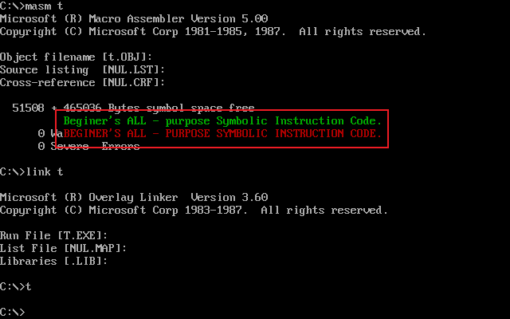

跳转指令又称为转移指令，是可以修改IP或同时修改CS，IP寄存器的指令。

### jmp
jmp 是一种无条件转移指令，本质上是修改 cs:ip 这两个寄存器的值，决定了 CPU 从哪里读取指令。

```
jmp cs:ip       ; jmp 2000:0 跳转到20000的地址处
jmp reg         ; reg是一个寄存器,它只修改的是ip的值
jmp 标号
```
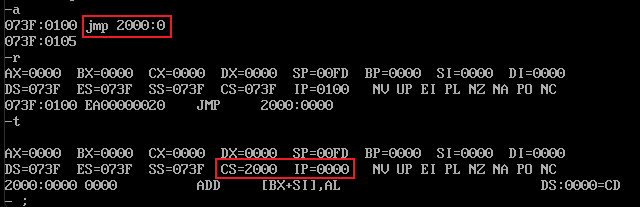

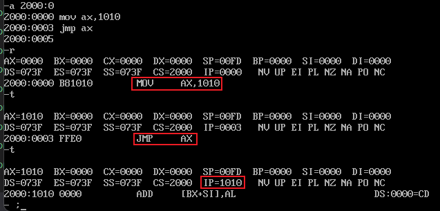

jmp 的短跳转机器码为 0XEB, 如下图：下图中的JMP对应的机器码为 EB01,其中01是位移范围，我们有以下结论：

```
jmp的位移值 = 标号地址 - jmp指令后的第一个字节的地址
（对应下图中：01 = 0003 - 0002）
```
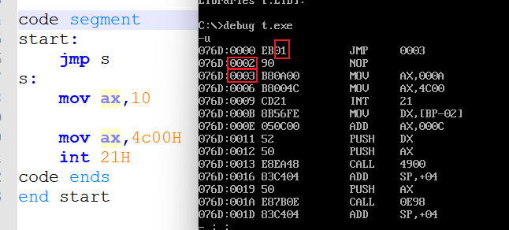


下图中：jmp的位移值 = 标号地址03 - jmp指令后的第一个字节的地址08 = FB(即 -5)

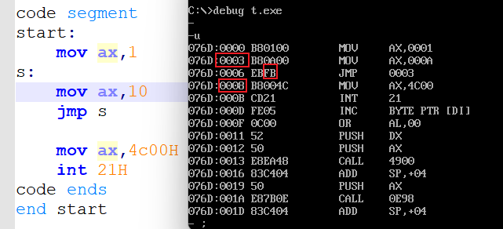

jmp位移值是有范围的，即8位位移范围为 -128~127; 也有16位位移范围为 -32768~32767
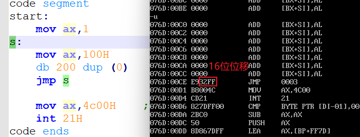

我们可以手动指定使用8位/16位移，如下使用：
```
    jmp short 标号      ; 指定8位位移
    jmp near ptr 标号   ; 指定16位位移
```

```
    jmp far ptr 标号   ; 参考 call far ptr 标号
```

另外，转移地址还可以存入到寄存器中，如下：
```
mov ax,2233H
jmp ax      ;ip = 0x2233
```

转移地址还可以存放到内存地址中，如下：
```
jmp word ptr ds:[0]     ; ip = ds:[1] << 8 | ds:[0]

jmp dword ptr ds:[0]    ; 注意：这里同时修改了CS和IP，CS=ds:[3]<<8|ds:[2], IP=ds:[1]<<8|ds:[0]
```

### call

```
call 标号
等价于：
push ip
jmp near ptr 标号
(注意，"call 标号" 的机器码中包含了16位的位移)
```
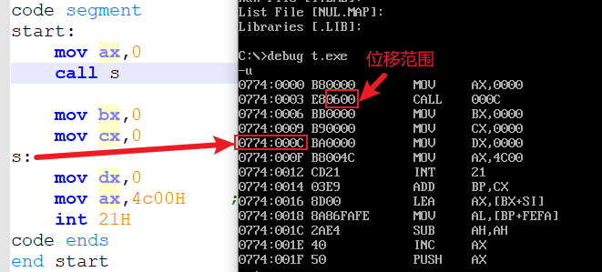

"call 标号" 的跳转由位移指定，跳转地址=call的下条指令的第一个字节的地址+位移 = 0006 + 0006 = 000C，刚好就是标号 s。

**转移的目的地址在指令(机器码)中的 call 指令：**

指令格式： call far ptr 标号

```
call far ptr 标号
等价于：
push cs
push ip
jmp far ptr 标号
（cs为标号所在段的段地址；ip为标号所在段的偏移地址）
(注意，"call far ptr 标号" 的机器码中包含的不是位移了，而是直接的cs和ip的值)
```
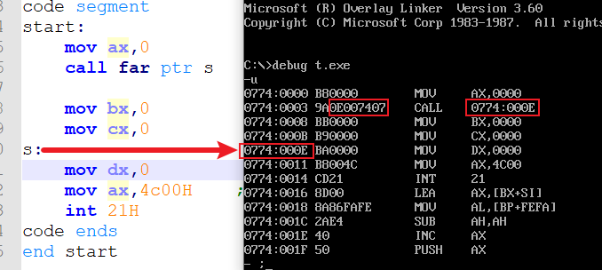

可以看到，"call far ptr 标号" 所对应的机器码中直接包含了目的地址(cs:ip)，所以跳转时直接跳到 cs:ip 处即可。


注意：执行 call 指令时引起的 push ip, 此时的 ip 是 "IP + 所读指令的长度" 后的 ip 值。(请仔细阅读"指令的执行过程"一节)。如上图中 push ip时，ip 的值为0x0008 而不是 0x0003。

**转移地址在寄存器中的 call 指令：**

指令格式：call 16位寄存器

```
call 16寄存器
等价于：
push ip
jmp 16位寄存器      (这里修改了 ip 值，ip值 = 16位寄存器的值)
```
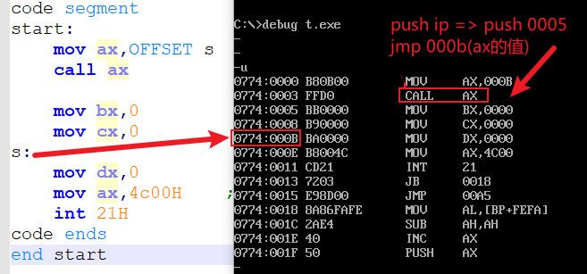

**转移地址在内存中的 call 指令：**

指令格式 "call word ptr 内存单元地址"；"call dword ptr 内存单元地址"

```
call word ptr 内存单元地址
等价于：
push ip
jmp word ptr 内存单元地址

call dword ptr 内存单元地址
等价于：
push cs
push ip
jmp dword ptr 内存单元地址
```

示例：求下面代码中的 ax,bx 的值？

```
assume cs:code
data segment
    dw 8 dup(0)
data ends

code segment
start:  
    mov ax,data
    mov ss,ax
    mov sp,16

    mov word ptr cs:[0],OFFSET s
    mov ss:[2],cs

    call dword ptr ss:[0]       ;push cs, push ip, jmp dword ptr ss:[0]
    nop

s:   
    mov ax,OFFSET s     
    sub ax,ss:[0CH]             ;ss:[0CH]中存放的是指向 nop 指令的ip地址 ，所以 ax=1

    mov bx,cs
    sub bx,ss:[0EH]             ;ss:[0EH]中存放的是cs的地址，所以bx=0

    mov ax,4C00H
    int 21H
code ends
ends
```

### ret/retf
当执行 ret 指令时，相当于执行了 pop ip 指令。

当执行 retf 指令时，相当于执行了 pop ip 指令，然后再执行 pop cs 指令。

```
ret 
等价于：
pop ip

retf 
等价于：
pop ip
pop cs
```

所以，使用 ret/retf 指令时，sp 值会变化(pop时修改了栈顶标记)。

### iret
中断返回指令

```
iret
等价于：
pop ip
pop cs
popf
```

### loop
loop 是一种有条件转移指令，是根据CX寄存器中的值来决定是否转移。它是有转移次数限制的(即循环多少次)，其循环次是保存在 CX 寄存器中。loop的一般使用方法为：

```
loop 标号
```

loop 指令的步骤：先将cx=cx-1,然后判断cx是否为0,不为0则跳转到标号位置执行,等于0则执行后面的指令，相对于C语言中：

```c
while (--cx) {
    ;跳转
}
```

loop 是一种短转移指令，其位移包含在机器码中，其位移范围为 -128~127。

## jcxz
jcxz为条件转移指令，其中 j为jmp,cx为cx寄存器，z为zero; 翻译一下就是：当 cx 寄存器中的值为 0 时，进行 jmp。

其刚好与 loop 相反，loop是当 cx 的值不为0时进行跳转。

```
注：所有的条件转移指令都是短转移(即8位)，其转移范围存放在编译后的机器码中。
```

jcxz 的使用方式如下：

```
jcxz 标号
```

## shl/shr
shl/shr 为逻辑移动指令。shl 左移；shr 右移；

左移或右移，移出的位被赋值到标志寄存器的 CF 位了。比如 10000001 左移1位为 00000010 最高位的1被赋值给CF了，此时 CF=1.

## lea
lea 指令全称为 load effective address。指令格式如下：

```
lea r m;    其中r为寄存器，m为内存地址，把m的地址存放到寄存器r中
```

lea 有三种使用方式：
- lea eax,[addr]
  将表达式addr的值放入eax中，注意addr是地址值，也需要[]括起来，但此处的方括号并不是取出addr地址处保存的值，而是直接取出addr这个地址，如 lea eax,[0x400000],即eax=0x400000
- lea eax,dword ptr [ebx]
  将 ebx 的值保存到 eax 中
- lea eax,c
  其中c是一个int型变量，即将c变量对应的地址值保存到eax寄存器中。

# 3. 伪指令
伪指令仅仅是告诉编译器如何翻译，本身不是指令。

```
start :告诉编译器程序的入口地址；实际上编译器会根据start的地址去设置cs:ip寄存器的值。

assume cs:code,ds:data,ss:stack :告诉编译器下面代码中出现code的就是cs段，data的就是ds段，stack的就是ss段。

data segment    :告诉编译器数据段从这里开始，其中data就是由assume设置的名字
data ends       :告诉编译器数据段在这里结束

stack segment stack
stack ends

code segment
code ends

end     :end指令告诉编译器整个汇编程序到这里就结束了
```

下面是对上面伪指令的示例：

```
assume cs:code,ds:data,ss:stack

data segment    ;定义数据段
    dw 0123H,0456H,0789H,0abcH,0defH,0cbaH,0987H,0876H
data ends

stack segment stack  ;定义栈段
    dw 0,0,0,0,0,0,0,0
    dw 0,0,0,0,0,0,0,0
stack ends

code segment
start:
    mov ax,data     ;设置数据段，即设置ds段
    mov ds,ax   

    mov ax,stack    ;设置栈段，即设置ss段
    mov ss,ax
    mov sp,32       ;设置栈容量

code ends
end start
```

# 4.其它关键字
## dw/db/dd
dw 全称为 define word 即用户自定义的字数据(双字节)，db 即用户自定义的字节数据。

```
db  : define byte
dw  : define word
dd  : define dword
```

定义方式如下：

```
dw 1,2,3,4,5,6,7,8
```

## dup
dup 重复定义，使用方法如下：
```
db 100 dup ('123')  ;重复定义100个 '123' 数据
db 100 dup ('123','abc')    ;重复定义100个 '123abc' 数据
dw 100 dup (1)      ;重复定义100个字型数据1

db 3 dup (0)  等价于 db 0,0,0
```

## word ptr/dword ptr/byte ptr
我们知道，我们可以通过寄存器来判断处理数据的宽度，如下：

```
mov ax,1    ;因为ax是16位的寄存器，所以这里的1就被翻译占用16位
mov al,1    ;因为al是8位的寄存器，所以这里的1就被翻译占用8位

mov ds:[0],1    ;请问这里的1到底是占8位还是占16位？为了说明这种情况就出现了 word ptr，如下
mov word ptr ds:[0],1   ;因为有word ptr的说明，所以这里的1占16位

;还可以有如下写法：
add word ptr ds:[0],20
inc word ptr ds:[0]
```

同理，dword ptr 占32位，即4字节；byte ptr 占1字节。

## OFFSET
OFFSET是获取标号处的偏移地址，使用方式如下：
```
code segment
start:
    mov ax,OFFSET start
s:
    mov ax,OFFSET s

    mov ax,4c00H    ;程序返回
    int 21H
code ends
end start
```

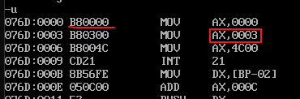

上面代码示例中，mov ax,OFFSET start 中的 ax = 0，因为start相对于code段的偏移地址为0，而该条指令占3个字节，所以 mov ax,OFFSET s 中的 ax = 3，因为s标号相对于code段的偏移地址为3。

## short/near ptr
再使用 jmp 指定8位或16位位移时使用。参见 jmp 指定。

# 5.寻址方式
```
ds:[0]
ds:[bx]
ds:[bx+si]
ds:[bx+si+5]
ds:[si+5], ds:[di+5]
```

# 6.中断
## 中断向量表
中断向量表，其地址范围为：0000:0000 ~ 0000:03FF

中断向量表保存着每一个中断处理程序的入口地址(cs:ip)。

|中断号|IP(低2字节)：CS(高2字节)|指令
|:--:|:--|:--:
0|除法错误处理程序入口地址|int 0
9|键盘中断程序入口地址|int 9
13|对磁盘进行读写|int 13
16|读键盘缓冲存中的数据|int 16

更详细的中断向量表请参考《操作系统真象还原》第 0.20 节。

CPU通过中断号找到中断向量表中的中断处理程序的入口地址，然后修改CS:IP，之后跳转到中断处理程序中执行。比如执行指令 int 0 时，cs:ip就会被自动修改，然后执行除法错误程序。

## 中断执行过程
1. 取得中断号
2. 保存标志位寄存器到栈中 (pushf)
3. 禁止中断(将标志位寄存器的第8位TF和第9位IF设置为0)
4. 保存被中断的位置，即 push cs, push ip
5. 设置cs:ip跳转到中断程序，即cs=N\*4+2 ip=N\*4 （N为中断号）

中断的返回，直接调用指令 iret 即可。

## int 指令
int 指令相当于 call dword ptr(只不过cs和ip的值是从中断向量表中获取); 执行int指令时，cpu会自动做上一小节提到的"中断执行过程"中的步骤。

```
int
等价于：
pushf
push cs
push ip
```

这里有一个示例：修改0号中断的内容，使其调用 int 0 时全屏显示"!"，执行效果如下：
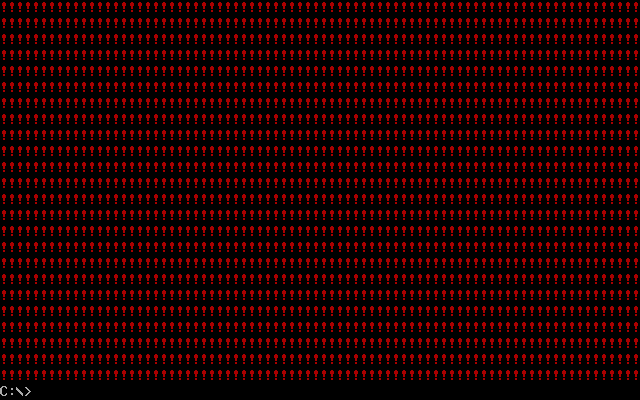

示例代码见 code/int_rep.asm 文件。

## iret 指令
iret指令与 int 指令配合使用。

```
iret
等价于：
pop ip
pop cs
popf
```

## cli/sti
cli 设置标志寄存器 IF = 0;

sti 设置标志寄存器 IF = 1

# CMOS时钟
CMOS 有一个 128字节的内存单元，其 0 ~ DH保存时间信息，其中 70H 为地址端口，71H 为数据端口。

0-秒 2-分 4-时 7-日 8-月 9-年  BCD码

```
;读取CMOS RAM的2号单元内容
mov al,2
out 70H,al  ;将2写入地址端口，准备控制2号内存单元
in al,71H   ;从数据端口中读取数据(读取到的就是2号内存单元)

;向CMOS RAM的2号单元写入0
mov al,2
out 70H,al
mov al,0
out 71H,al
```

注意，in/out 指令只能通过 al/ax操作。

# 直接定址表
```
data segment
a   db  1,2,3,4,5,6,7,8
b   dw  0
c   db  11H
x   dw  OFFSET a,seg a,OFFSET b seg b
```

上述代码中的 `seg` 是取得 a/b 的代码段地址。x 所列出来的就直接定址表，记录了 a,b的代码段地址及偏移。

# 汇编示例
## 编程1
编程：在屏幕中间分别显示 绿色、绿底红字、白底蓝色 的字符串"welcome to masm!"。

编程所需的知识通过阅读，分析下面的材料获得。

dosbox模拟的屏幕为 80*25彩色字符模式显示缓冲区(以下简称为显示缓冲区)的结构：内存在址空间范围：B800H ~ BFFFH，共32KB。此空间即为显示缓冲区。向这个地址写入的数据会立即出现在显示器上。

80代表屏幕一行可以显示80个字符，25代表屏幕共可以显示25行。每个字符可以有256种属性，这样，一个字符在显示缓冲区中就要占用两个字节，分别存放字符的ASCII码和属性。如下：

```
显示缓冲区地址 B800  B803  B805 ...
              3101  3202  3303
```
显示缓冲区B8000地址处的31代表了字符的ASCII，而B8001地址处的01代表了31这个字符的属性，依次类推...

所以可以有以下简单的结论：显示缓冲区的偶数地址都是存放字符的ASCII码，而奇数地址则存放字符的属性(如颜色等)

所以说，屏幕的一行可以显示80个字符，那一行共需要80\*2=160个字节，这样的话，一个屏幕所占用的字节数就是：80\*2\*25=4000B（约4KB）。

显示缓存区分为8页，每页4KB，显示器可以显示任意一页的内容，一般情况下，显示第0页的内容。

字符属性说明：
```
0000 0000   ;字符属性共占用一个字节
 rgb  rgb   ;bit4~bit6为背景(底色)，bit0~bit2为前景(字体颜色) bit7为闪烁(只有全屏dos下才能看到效果)，bit3为高亮
```

例如：
```
0100 0010   ;红底绿字
0100 1010   ;红底高亮绿字
0000 0111   ;黑底白字
0111 0001   ;白底蓝字
```

代码参考 code 目录下的 display.asm 文件。实现结果如下图：
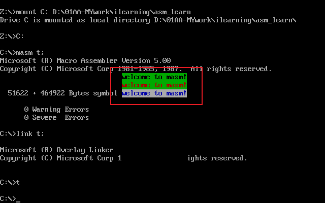

