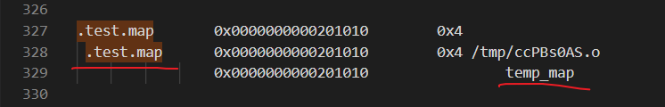

# 1. 简要介绍
\_\_attribute__ 是 GNU C 实现的编译属性设置机制，也就是通过给函数或者变量声明属性值，以便让编译器能够对要编译的程序进行优化处理。
更多详细内容，请看这篇官网文档：[《Unixwiz.net - Software Consulting Central -- Using GNU C \_\_attribute__》](http://www.unixwiz.net/techtips/gnu-c-attributes.html)，而对于 section 这个关键字，我们可以将通过它将指定的变量定义到指定的输入段中。

举个例子，看下面一段代码：

```c
int a __attribute__((section("var"))) = 0;
```

首先我们定义了一个整形变量 a，然后将其赋值为0，而中间的 `__attribute__((section("var")))` 语句的作用是将变量 a 放入指定的段 var 中。而如果不指定变量所处的段的话，编译器就会随机将其分配在内存中。

值得注意的是，不仅 GUN C可以使用该属性，一些支持 GNU C 扩展的编译器也支持，比如我们开发常用的 ARM 编译器。

来自：[keil 官方：attribute((section("name"))) variable attribute](https://developer.arm.com/documentation/dui0375/g/Compiler-specific-Features/--attribute----section--name-----variable-attribute)

但是同样很多编译器不支持，如果发现使用不了，请查看该编译器是否支持这个特性。

# 2. 用途
使用 \_\_attribute__((section(x))) 指定变量所放置的段中的，用处是方便实现优雅的初始化函数调用。在 RT-Thread 和 Linux 中就有使用该特性用来实现函数的初始化调用。

当然，对于单片机的一些裸机项目，也可以使用这种方式对一些函数进行初始化，实现初始化的隐式调用，这样就不用在某处显式调用了，使得模块间耦合度更低。

# 3. 示例
下面是测试代码：

```c
#include "stdio.h"

int temp_map __attribute__((section(".test.map"))) = 1;

int main(int argc, const char *argv[])
{
    printf("test map file. temp_map = %d\r\n", temp_map);
    return 0;
}
```

编译： `gcc test.c -o test -Wl,-Map=test.map`

查看 test.map 文件，有如下内容：




