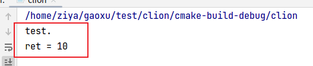

# 内联函数
在 C 语言中，我们可以指定编译器将一个函数代码直接复制到调用其代码的地方执行。这种函数调用方式和默认压栈调用方式不同，我们称这种函数为内联函数。有点像宏。

优点：内联函数降低了函数的调用开销

实现：指定编译器将一个函数处理为内联函数，我们只要在函数声明前加上 **inline** 关键字就可以了。

# 内联汇编
基于对上述内联函数的认知，我们大概可以想象出内联汇编到底是怎么一回事了。内联汇编相当于用汇编语句写成的内联函数。

优点：效率高。

实现：使用 asm 关键字。

关键：之所以内联汇编如此有用，主要是因为它可以操作 C 语言变量，比如可以从 C 语言变量获取值，输出值到 C 语言变量。由于这个能力，asm 用作汇编指令和包含它的 C 程序之间的接口。

# GCC汇编格式
GCC（GNU Compiler for Linux）使用 AT&T/UNIX 汇编语法：

1. 第一个操作数是源操作数，第二个是目的操作数

```
OP-code src dst //AT&T语法
```

2. 寄存器命令

在 AT&T 汇编中，寄存器名前面有 % 前缀。例如，如果要使用 eax，得写成：%eax。

3. 立即数

在 AT&T 语法中，立即数都有 '$' 前缀。如 `"movl $78, %1 \n"`

4. 操作数大小

在 AT&T 语法中，操作符的最后一个字符决定着操作数访问内存的长度：以 'b'、'w' 和 'l' 为后缀指明内存访问长度是 byte(8-bit)、word(16-bit) 还是 long(32-bit)。例：`movb foo, %al`。

5. 内存操作数

基址寄存器是放在小括号`()`内的。例：`section: disp(base, index, scale)`

# 基本内联汇编(Basic Inline)

基本内联汇编的格式比较简单。如下：`asm("assembly code")`

例子：`asm("movl %ecx %eax"); /*moves the contents of ecx to eax*/`

如果内联汇编有多条指令，则每行都要加上双引号，并且该行要以 `\n\t` 结尾。这是因为 GCC 会将每行指令作为一个字符串传给 as(GAS)，使用换行和 TAB 可以将正确且格式良好的代码行传递给汇编器。

例子：

```c
 asm ("movl %eax, %ebx\n\t"
          "movl $56, %esi\n\t"
          "movl %ecx, $label(%edx,%ebx,$4)\n\t"
          "movb %ah, (%ebx)");

```

如果在内联代码中操作了一些寄存器，比如你修改了寄存器内容（而之后也没有进行还原操作），程序很可能会产生一些难以预料的情况。因为此时GCC并不知道你已经将寄存器内容修改了。这点尤其是在编译器对代码进行了一些优化的情况下而导致问题。因为编译器注意不到寄存器内容已经被改掉，程序将当作它没有被修改过而继续执行。所以此时我们尽量不要使用这些会产生附加影响的操作，或者当我们退出的时候还原这些操作。否则很可能会造成程序崩溃。可是如果我们必须要这样操作该怎么办呢？我们可以通过下面的讨论的扩展内联汇编进行。

# 扩展内联汇编(Extended Asm)
前面讨论的基本内联汇编只涉及到嵌入汇编指令，而在扩展形式中，我们还可以指定操作数，并且可以选择输入输出寄存器，以及指明要修改的寄存器列表。对于要访问的寄存器，并不一定要要显式指明，也可以留给GCC自己去选择，这可能让GCC更好去优化代码。扩展内联汇编格式如下:

```c
asm ( assembler template
        : output operands                /* optional */
        : input operands                 /* optional */
        : list of clobbered registers    /* optional */
);
```

其中 assembler template 为汇编指令部分。

前两个冒号后面的是操作数（输出、输入）`：`第一个冒号将汇编模板与第一个输出操作数分开，第二个冒号将最后一个输出操作数与第一个输入操作数（如果有）分开。总结就是`：`不同类型的操作数使用 `:` 分隔，相同类型的操作数使用 `,` 分隔。

逗号分隔每个组中的操作数。

操作数的总数为 10。

寄存器名称前有两个 `%`，这有助于 GCC 区分操作数和寄存器。操作数有一个 `%` 作为前缀。

如果没有输出操作数但有输入操作数，那么输出操作数前的冒号不能省，例：

```c
    asm ("cld\n\t"
	    "rep\n\t"
	    "stosl"
	    : /* no output registers */
	    : "c" (count), "a" (fill_value), "D" (dest)
	    : "%ecx", "%edi" 
	    );
```

每个操作数由一个操作数限定字符描述，后面小括号中跟 C 语言变量或表达式，例：

```c
	int a=10, b;
    asm ("movl %1, %%eax; 
         movl %%eax, %0;"
         :"=b"(b)        /* output */
         :"c"(a)         /* input */
         :"%eax"         /* clobbered register */
        );  
```

输出操作数有一个限定字符 `=`，这个修饰符表示它是输出操作数并且是只写的。

寄存器约束 `b`，表示将输出放入变量 `ebx`，并把 ebx 的值赋值给c语言变量b。（eax 已被使用）

寄存器约束 `c`，表示将c语言变量a的值输入到 `ecx` 寄存器中。

详细的：
|限定字符|含义|
|:--:|:--:|
"a"|将输入变量放入eax
"b"|将输入变量放入ebx
"c"|将输入变量放入ecx
"d"|将输入变量放入edx
"S"|将输入变量放入esi
"D"|将输入变量放入edi
"q"|将输入变量放入eax，ebx ,ecx ，edx中的一个
"r"|将输入变量放入通用寄存器，也就是eax ，ebx，ecx,edx，esi，edi中的一个
"A"|放入eax和edx，把eax和edx，合成一个64位的寄存器(uselong longs)
"m"|内存变量
"o"|操作数为内存变量，但是其寻址方式是偏移量类型，也即是基址寻址，或者是基址加变址寻址
"V"|操作数为内存变量，但寻址方式不是偏移量类型
" "|操作数为内存变量，但寻址方式为自动增量
"p"|操作数是一个合法的内存地址（指针）
"g"|将输入变量放入eax，ebx，ecx ，edx中的一个或者作为内存变量
"X"|操作数可以是任何类型
"l"|0-31 之间的立即数（用于32位移位指令）
"J"|0-63 之间的立即数（用于64 位移位指令）
"N"|0-255 ，之间的立即数（用于out 指令）
"i"|立即数
"n"|立即数，有些系统不支持除字以外的立即数，这些系统应该使用“n”而不是“i”
"="|操作数在指令中是只写的（输出操作数）
"+"|操作数在指令中是读写类型的（输入输出操作数）
"f"|浮点数
"t"|第一个浮点寄存器
"u"|第二个浮点寄存器
"G"|标准的80387浮点常数
%|该操作数可以和下一个操作数交换位置
\#|部分注释
*|表示如果选用寄存器，则其后的字母被忽略
"&"|表示输入和输出操作数不能使用相同的寄存器

另：%0、%1…… %9 它们依次代表 10 个操作数。

# 简单实例
## 示例1
```c
#include <stdio.h>

int main()
{
    int a = 10;
    int b = 20;
    int c;
    int d;
	
    asm("movl %3, %%eax \n"
        "movl %%eax, %1 \n"
        :"=b"(c),"=c"(d)
        :"d"(a),"S"(b)
        :"%eax"
        );
    
    printf("d = %d\n", d);
}
```

编译运行：

```
$ gcc c_inline_asm.c 
$ ./a.out 
d = 20
```

解释如下：

```
:"=b"(c)
```

其中 `:` 分隔前面的汇编语句和后面的操作数；`=` 表示此操作数是输出操作数，属性是只写；`c` 代表 C 程序中的 变量 c，`b` 表示当向变量 c 写数据时，先向 ebx 寄存器中写入值，最终由 ebx 寄存器将值写入变量 c 中。

```
movl %3, %%eax
```

`%3` 代表第 4 个操作数（从 %0 开始），分别是 `%0` 代表 c，`%1` 代表 d，`%2` 代表 a，`%3` 代表 b，所以句汇编指令的含义是：将变量 b 的值赋给寄存器 eax。

```
"movl %%eax, %1 \n"
```

含义：将寄存器 eax 的值赋给变量 d。

所以，最终 d = 20

## 示例2
使用内联汇编调用 test 函数。

```c
#include <stdio.h>

int test(void)
{
    printf("test.\r\n");
    return 10;
}

int main() {
    int ret;
    __asm__("call %%rax":"=r"(ret):"a"(test):"memory");
    printf("ret = %d\r\n", ret);
    return 0;
}
```

输出结果如下图：



# 参考
[GCC-Inline-Assembly-HOWTO](https://www.ibiblio.org/gferg/ldp/GCC-Inline-Assembly-HOWTO.html#toc2)