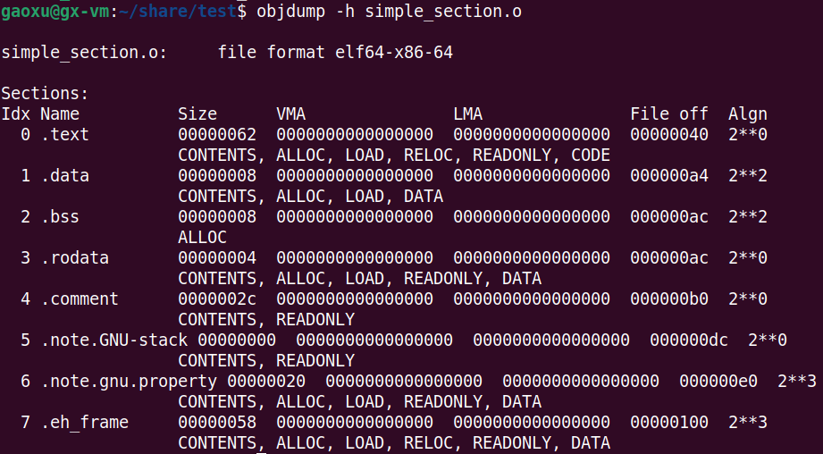
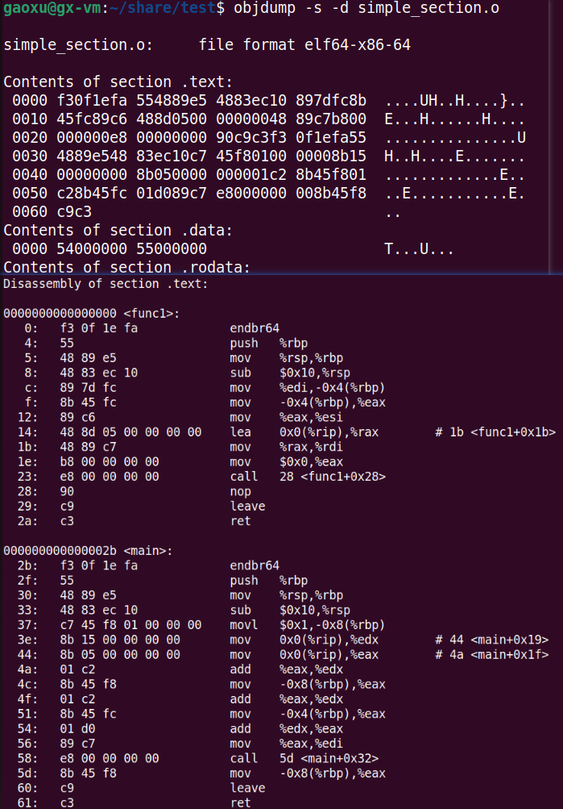
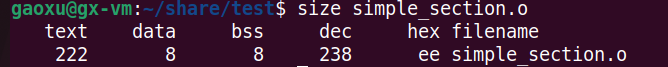
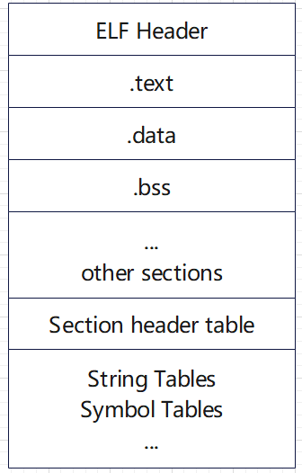
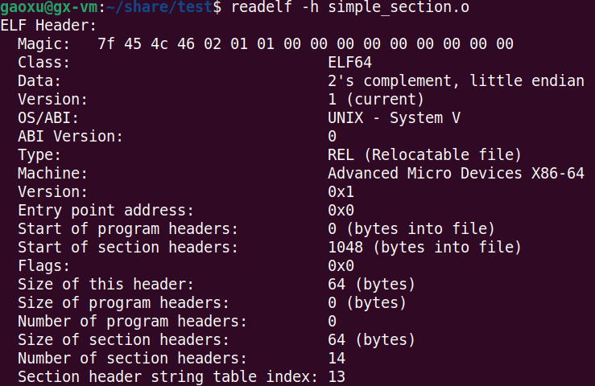
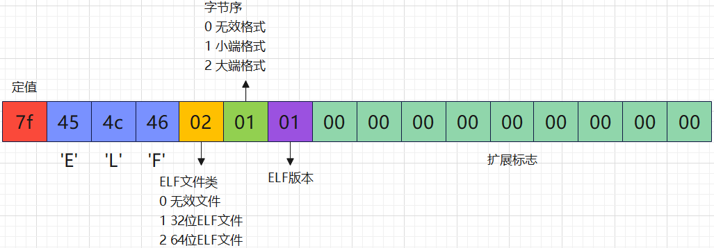
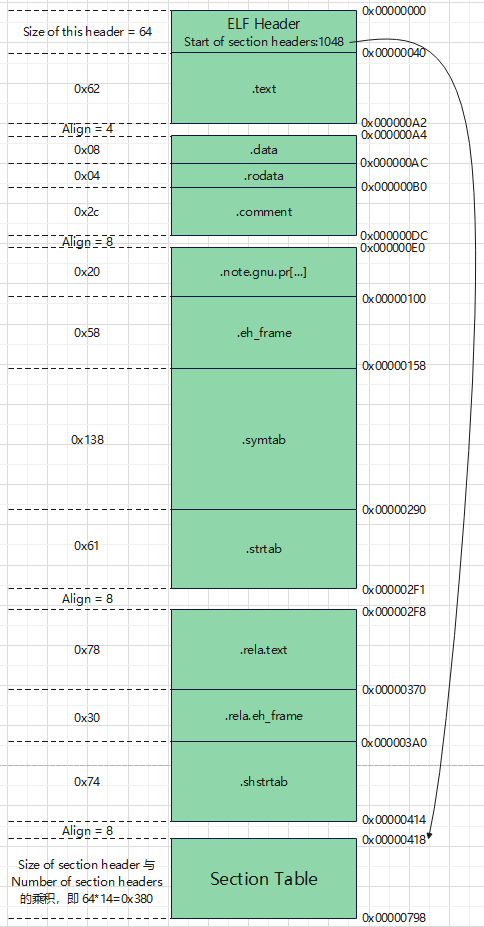
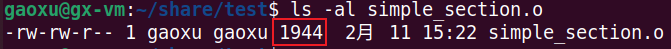

# 1. 目标文件里的段
以下面源码 simple_section.c 为例：

```c
int printf(const char *format, ...);

int global_init_var = 84;
int global_uninit_var;

void func1(int i)
{
    printf("%d\n", i);
}

int main(void)
{
    static int static_var = 85;
    static int static_var2;
    int a = 1;
    int b;

    func1(static_var + static_var2 + a + b);
    return a;
}
```

objdump 工具可以查看各种目标文件的结构和内容。如下：

```
gcc -c test.c -o test.o
objdump -h test.o   // -h 就是把ELF文件的各个段的基本信息打印出来
objdump -x test.o   // -x 也可以打印各个段的信息，只不过更为详细，更为复杂
```

Linux下还有一个工具叫 readelf，它是专门针对ELF文件格式的解析器，可以与 objdump 相互对照。




.text 代码段; .data 初始化的全局变量与局部静态变量; .bss 未初始化的全局变量与局部静态变量; .rodata 只读数据段; .comment 注释信息段; .note.GNU-stack 堆栈提示段; Size 为段长度; File off 为段所在的位置; CONTENTS,ALLOC...为段的属性, CONTENTS代表该段在ELF文件中是真实存在的。

```
// -s 可以将所有段的内容以十六进制的方式打印出来
// -d 可以将所有包含指令的段反汇编
objdump -s -d test.o
```



"Contents of section .text"就是.text的数据以十六进制方式打印出来的内容，最左侧一列是偏移量，最后一个值为0060，但又多了2个字节(c9c3)，所以.text的段大小为0060+2=0062，这与 `objdump -h` 的输出结果中的 Size 是一致的；中间4列是十六进制的内容，最右面一列是.text段的ASCII码形式。对照下面的反汇编结果，可以很明显的看到，.text段里所包含的正是 simple_section.c 里两个函数 func1() 和 main() 的指令。.text段的最后两个字节 c9c3 正是 main() 函数的最后两条指令 "leave","ret"。

size 工具可以用来查看 ELF 文件的代码段、数据段和BSS段的长度（dec表示3个段长度的和的十进制，hex表示3个段长度和的十六进制）。



# 2. ELF文件结构
ELF文件的基本结构图如下：



ELF目标文件格式的最前部是**ELF文件头**，它包含了描述整个文件的基本属性，比如ELF文件版本、目标机器型号、程序入口地址等。其中ELF文件中与段有关的重要结构就是**段表**，该表描述了ELF文件包含的所有段的信息，比如每个段的段名、段的长度、在文件中的偏移、读写权限及段的其它属性。

## 2.1 文件头(ELF Header)
使用如下命令查看文件头，

```
readelf -h test.o
```


从上面的输出结果可以看到，ELF的文件头中定义了**ELF魔数、文件机器字节长度、数据存储方式、版本、运行平台、ABI版本、ELF重定位类型、硬件平台、硬件平台版本、入口地址、程序头入口和长度、段表的位置和长度、段的数量**等。

ELF文件头结构及相关常数被定义在 <font color=red>/usr/include/elf.h</font>中。

ELF文件头结构相关说明如下：

|ELF Header|说明
|:--|:--|
Type|ELF文件类型；REL-可重定位文件(.o) EXEC-可执行文件 DYN-共享目标文件(.so); 系统通过此变量来判断ELF的真正文件类型，而不是通过后缀名
Entry point address|规定ELF程序的入口虚拟地址，操作系统在加载完该程序后从这个地址开始执行进程的指令。可重定位文件一般没有入口地址，则这个值为0
Start of program headers|这个与ELF链接视图与执行视图有关
Start of section headers|段表在文件中的偏移，上面的例子这个值是1048，也就是段表从文件的第1049个字节开始
Flags|用来标识一些ELF文件平台相关的属性
Size of this header|ELF文件头本身的大小
Size of program headers|这个与ELF链接视图与执行视图有关
Number of program headers|这个与ELF链接视图与执行视图有关
Size of section headers|段表描述符的大小
Number of section headers|段表描述符的数量。这个值等于ELF文件中拥有的段的数量
Section header string table index|段表字符串表所在的段在段表中的下标

ELF魔数格式如下：



## 2.2 段表
段表描述了ELF的各个段的信息，比如每个段的段名、段的长度、在文件中的偏移、读写权限及其他属性。也就是说，ELF文件的段结构就是由段表决定的，编译器、链接器、装载器都是依靠段表来定位和访问各个段的属性的。

使用 readelf 工具来查看ELF文件的段，它显示出来的结果才是真正的段表结构：

```
readelf -S test.o
```


上图输出的结果太乱了，整理一下如下：

```
There are 14 section headers, starting at offset 0x418:

Section Headers:
  [Nr] Name              Type             Address           Offset    Size              EntSize          Flags  Link  Info  Align
  [ 0]                   NULL             0000000000000000  00000000  0000000000000000  0000000000000000           0     0     0
  [ 1] .text             PROGBITS         0000000000000000  00000040  0000000000000062  0000000000000000  AX       0     0     1
  [ 2] .rela.text        RELA             0000000000000000  000002f8  0000000000000078  0000000000000018   I      11     1     8
  [ 3] .data             PROGBITS         0000000000000000  000000a4  0000000000000008  0000000000000000  WA       0     0     4
  [ 4] .bss              NOBITS           0000000000000000  000000ac  0000000000000008  0000000000000000  WA       0     0     4
  [ 5] .rodata           PROGBITS         0000000000000000  000000ac  0000000000000004  0000000000000000   A       0     0     1
  [ 6] .comment          PROGBITS         0000000000000000  000000b0  000000000000002c  0000000000000001  MS       0     0     1
  [ 7] .note.GNU-stack   PROGBITS         0000000000000000  000000dc  0000000000000000  0000000000000000           0     0     1
  [ 8] .note.gnu.pr[...] NOTE             0000000000000000  000000e0  0000000000000020  0000000000000000   A       0     0     8
  [ 9] .eh_frame         PROGBITS         0000000000000000  00000100  0000000000000058  0000000000000000   A       0     0     8
  [10] .rela.eh_frame    RELA             0000000000000000  00000370  0000000000000030  0000000000000018   I      11     9     8
  [11] .symtab           SYMTAB           0000000000000000  00000158  0000000000000138  0000000000000018          12     8     8
  [12] .strtab           STRTAB           0000000000000000  00000290  0000000000000061  0000000000000000           0     0     1
  [13] .shstrtab         STRTAB           0000000000000000  000003a0  0000000000000074  0000000000000000           0     0     1
Key to Flags:
  W (write), A (alloc), X (execute), M (merge), S (strings), I (info),
  L (link order), O (extra OS processing required), G (group), T (TLS),
  C (compressed), x (unknown), o (OS specific), E (exclude),
  D (mbind), l (large), p (processor specific)
```

下面对 Section Headers 各项进行说明：

|项|说明
|:--|:--|
Name|段名;段名是一个字符串，它位于一个叫做".shstrtab"的字符串表中。段名是在".shstrtab"中的偏移
Type|段的类型，参见下文"段的类型"
Address|段虚拟地址;如果该段可以被加载，则此参数为该段被加载后在进程地址空间中的虚拟地址，否则此参数为0
Offset|段偏移;如果该段存在于文件中，则表示该段在文件中的偏移，否则无意义，比如对于.bss段来说此参数无意义
Size|段的长度
EntSize|项的长度;有些段包含了一些固定大小的项，比如符号表，它包含的每个符号所占的大小都是一样的。对于这种段，此参数表示每个项的大小。如果为0，则表示该段不包含固定大小的项
Flags|段的标志位，参见下文"段的标志位"
Link、Info|段链接信息，参见"段的链接信息"
Align|段地址对齐;此参数为0或1时表示该段没有对齐要求

分析到此，可以看到例子中的程序的所有段的位置和长度了，可以画出更详细的ELF文件结构图了，如下：



可以看到，整个文件的大小为 0x798 = 1944，其大小正好是 semple_section.o 文件的大小。



