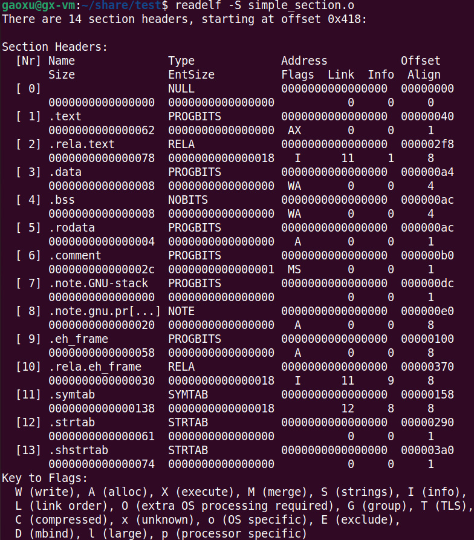

# 1. 目标文件里的段
以下面源码 simple_section.c 为例：

```c
int printf(const char *format, ...);

int global_init_var = 84;
int global_uninit_var;

void func1(int i)
{
    printf("%d\n", i);
}

int main(void)
{
    static int static_var = 85;
    static int static_var2;
    int a = 1;
    int b;

    func1(static_var + static_var2 + a + b);
    return a;
}
```

objdump 工具可以查看各种目标文件的结构和内容。如下：

```
gcc -c test.c -o test.o
objdump -h test.o   // -h 就是把ELF文件的各个段的基本信息打印出来
objdump -x test.o   // -x 也可以打印各个段的信息，只不过更为详细，更为复杂
```

Linux下还有一个工具叫 readelf，它是专门针对ELF文件格式的解析器，可以与 objdump 相互对照。


.text 代码段; .data 初始化的全局变量与局部静态变量; .bss 未初始化的全局变量与局部静态变量; .rodata 只读数据段; .comment 注释信息段; .note.GNU-stack 堆栈提示段; Size 为段长度; File off 为段所在的位置; CONTENTS,ALLOC...为段的属性, CONTENTS代表该段在ELF文件中是真实存在的。

```
// -s 可以将所有段的内容以十六进制的方式打印出来
// -d 可以将所有包含指令的段反汇编
objdump -s -d test.o
```


"Contents of section .text"就是.text的数据以十六进制方式打印出来的内容，最左侧一列是偏移量，最后一个值为0060，但又多了2个字节(c9c3)，所以.text的段大小为0060+2=0062，这与 `objdump -h` 的输出结果中的 Size 是一致的；中间4列是十六进制的内容，最右面一列是.text段的ASCII码形式。对照下面的反汇编结果，可以很明显的看到，.text段里所包含的正是 simple_section.c 里两个函数 func1() 和 main() 的指令。.text段的最后两个字节 c9c3 正是 main() 函数的最后两条指令 "leave","ret"。

size 工具可以用来查看 ELF 文件的代码段、数据段和BSS段的长度（dec表示3个段长度的和的十进制，hex表示3个段长度和的十六进制）。


# 2. ELF文件结构
ELF文件的基本结构图如下：


ELF目标文件格式的最前部是**ELF文件头**，它包含了描述整个文件的基本属性，比如ELF文件版本、目标机器型号、程序入口地址等。其中ELF文件中与段有关的重要结构就是**段表**，该表描述了ELF文件包含的所有段的信息，比如每个段的段名、段的长度、在文件中的偏移、读写权限及段的其它属性。

## 2.1 文件头(ELF Header)
使用如下命令查看文件头，

```
readelf -h test.o
```


从上面的输出结果可以看到，ELF的文件头中定义了**ELF魔数、文件机器字节长度、数据存储方式、版本、运行平台、ABI版本、ELF重定位类型、硬件平台、硬件平台版本、入口地址、程序头入口和长度、段表的位置和长度、段的数量**等。

ELF文件头结构及相关常数被定义在 <font color=red>/usr/include/elf.h</font>中。

ELF文件头结构相关说明如下：

|ELF Header|说明
|:--|:--|
Type|ELF文件类型；REL-可重定位文件(.o) EXEC-可执行文件 DYN-共享目标文件(.so); 系统通过此变量来判断ELF的真正文件类型，而不是通过后缀名
Entry point address|规定ELF程序的入口虚拟地址，操作系统在加载完该程序后从这个地址开始执行进程的指令。可重定位文件一般没有入口地址，则这个值为0
Start of program headers|这个与ELF链接视图与执行视图有关
Start of section headers|段表在文件中的偏移，上面的例子这个值是1048，也就是段表从文件的第1049个字节开始
Flags|用来标识一些ELF文件平台相关的属性
Size of this header|ELF文件头本身的大小
Size of program headers|这个与ELF链接视图与执行视图有关
Number of program headers|这个与ELF链接视图与执行视图有关
Size of section headers|段表描述符的大小
Number of section headers|段表描述符的数量。这个值等于ELF文件中拥有的段的数量
Section header string table index|段表字符串表所在的段在段表中的下标

ELF魔数格式如下：


## 2.2 段表
段表描述了ELF的各个段的信息，比如每个段的段名、段的长度、在文件中的偏移、读写权限及其他属性。也就是说，ELF文件的段结构就是由段表决定的，编译器、链接器、装载器都是依靠段表来定位和访问各个段的属性的。

使用 readelf 工具来查看ELF文件的段，它显示出来的结果才是真正的段表结构：

```
readelf -S test.o
```



上图输出的结果太乱了，整理一下格式如下：

```
There are 14 section headers, starting at offset 0x418:

Section Headers:
  [Nr] Name              Type             Address           Offset    Size              EntSize          Flags  Link  Info  Align
  [ 0]                   NULL             0000000000000000  00000000  0000000000000000  0000000000000000           0     0     0
  [ 1] .text             PROGBITS         0000000000000000  00000040  0000000000000062  0000000000000000  AX       0     0     1
  [ 2] .rela.text        RELA             0000000000000000  000002f8  0000000000000078  0000000000000018   I      11     1     8
  [ 3] .data             PROGBITS         0000000000000000  000000a4  0000000000000008  0000000000000000  WA       0     0     4
  [ 4] .bss              NOBITS           0000000000000000  000000ac  0000000000000008  0000000000000000  WA       0     0     4
  [ 5] .rodata           PROGBITS         0000000000000000  000000ac  0000000000000004  0000000000000000   A       0     0     1
  [ 6] .comment          PROGBITS         0000000000000000  000000b0  000000000000002c  0000000000000001  MS       0     0     1
  [ 7] .note.GNU-stack   PROGBITS         0000000000000000  000000dc  0000000000000000  0000000000000000           0     0     1
  [ 8] .note.gnu.pr[...] NOTE             0000000000000000  000000e0  0000000000000020  0000000000000000   A       0     0     8
  [ 9] .eh_frame         PROGBITS         0000000000000000  00000100  0000000000000058  0000000000000000   A       0     0     8
  [10] .rela.eh_frame    RELA             0000000000000000  00000370  0000000000000030  0000000000000018   I      11     9     8
  [11] .symtab           SYMTAB           0000000000000000  00000158  0000000000000138  0000000000000018          12     8     8
  [12] .strtab           STRTAB           0000000000000000  00000290  0000000000000061  0000000000000000           0     0     1
  [13] .shstrtab         STRTAB           0000000000000000  000003a0  0000000000000074  0000000000000000           0     0     1
Key to Flags:
  W (write), A (alloc), X (execute), M (merge), S (strings), I (info),
  L (link order), O (extra OS processing required), G (group), T (TLS),
  C (compressed), x (unknown), o (OS specific), E (exclude),
  D (mbind), l (large), p (processor specific)
```

下面对 Section Headers 各项进行说明：

|项|说明
|:--|:--|
Name|段名;段名是一个字符串，它位于一个叫做".shstrtab"的字符串表中。段名是在".shstrtab"中的偏移
Type|段的类型，参见下文"段的类型"
Address|段虚拟地址;如果该段可以被加载，则此参数为该段被加载后在进程地址空间中的虚拟地址，否则此参数为0
Offset|段偏移;如果该段存在于文件中，则表示该段在文件中的偏移，否则无意义，比如对于.bss段来说此参数无意义
Size|段的长度
EntSize|项的长度;有些段包含了一些固定大小的项，比如符号表，它包含的每个符号所占的大小都是一样的。对于这种段，此参数表示每个项的大小。如果为0，则表示该段不包含固定大小的项
Flags|段的标志位，参见下文"段的标志位"
Link、Info|段链接信息，参见"段的链接信息"
Align|段地址对齐;此参数为0或1时表示该段没有对齐要求

分析到此，可以看到例子中的程序的所有段的位置和长度了，可以画出更详细的ELF文件结构图了，如下：


可以看到，整个文件的大小为 0x798 = 1944，其大小正好是 semple_section.o 文件的大小。


- <font color=red>**段的类型**</font>

对于编译器和链接器来说，主要决定段的属性的是段的类型和段的标志位。段的类型取值如下：

|取值|含义|
|:--|:--|
NULL|无效段
PROGBITS|程序段。代码段、数据段都是这种类型
SYMTAB|表示该段的内容为符号表
STRTAB|表示该段的内容为字符串表
RELA|重定位表。该段包含了重定位信息，参见"静态地址决议和重定位"
HASH|符号表的哈希表。见"符号表"一节
DYNAMIC|动态链接信息，见"动态链接"
NOTE|提示性信息
NOBITS|表示该段在文件中没有内容，比如.bss段
REL|该段包含了重定位信息，参见"静态地址决议和重定位"
SHLIB|保留
DNYSYM|动态链接的符号表，见"动态链接"

- <font color=red>**段的标志位**</font>

段的标志位表示该段在进程虚拟地址空间中的属性，比如是否可写，是否可执行等。取值如下：

|取值|含义|
|:--|:--|
WRITE|表示该段在进程空间中可写
ALLOC|表示该段在进程空间中须要分配空间。有些包含指示或控制信息的段不须要在进程空间中被分配空间，它们一般不会有这个标志。像代码段、数据段和.bss段都会有这个标志位
EXECINSTR|表示该段在进程空间中可以被执行，一般指代码段

- <font color=red>**段的链接信息**</font>

如果段的类型是与链接相关的(不论是动态链接或静态链接)，比如重定位表、符号表等，那么 Link, Info 这两个参数所包含的意义如下表所示：(对于其它类型的段，这两个参数没有意义)

|Type|Link|Info|
|:--|:--|:--|
DYNAMIC|该段所使用的字符串表在段表中的下标|0
HASH|该段所使用的符号表在段表中的下标|0
REL,RELA|该段所使用的相应符号表在段表中的下标|该重定位表所作用的段在段表中的下标
SYMTAB,DYNSYM|操作系统相关的|操作系统相关的
other|UNDEF|0

## 2.3 重定位表
我们注意到 simple_section.o 中有一个叫做 .rela.text 的段，它的类型为 RELA，也就是说它是一个**重定位表**。链接器在处理目标文件时，须要对目标文件中某些部位进行重定位，即代码段和数据段中那些绝对地址的引用的位置。这些重定位的信息都记录在 ELF 文件的重定位表里面，对于每个须要重定位的代码段或数据段，都会有一个相应的重定位表。比如 simple_section.o 中的 .rela.text 就是针对 .text 段的重定位表，因为 .text 段中至少有一个绝对地址的引用，那就是 printf 函数的调用；而 .data 段则没有对绝对地址的引用，所以没有针对 .data 段的重定位表 .rela.data。

一个重定位表同时也是 ELF 的一个段，那么这个段的类型就是 RELA，它的 Link 参数表示符号表的下标，Info 参数表示它作用于哪个段。比如 .rela.text 作用于 .text 段，而 .text 段的下标为1，那么 .rela.text 的 Info 参数就为1。

## 2.4 字符串表
一般字符串表在ELF文件中也是以段的形式保存，常见的段名为 .strtab 或 .shstrtab。这两个字符串表分别为**字符串表**和**段表字符串表**。字符串表用来保存普通的字符串，比如符号的名字；段表字符串表用来保存段表中用到的字符串，最常见的就是段名。

我们知道，段表字符串表也是ELF文件中一个普通的段，所以文件头(objdump -h读出)中的"Section header string table index"所代表的就是 .shstrtab 段在段表(readelf -S读出)中的下标。由此，我们可以得出结论，只有分析 ELF 文件头，就可以得到段表和段表字符串的位置，从而解析整个 ELF 文件。

# 3. 链接的接口 —— 符号
在链接中，目标文件之间相互拼合实际上是目标文件之间对地下的引用，即对函数和变量的地址的引用。比如目标文件B用到了目标文件A中的函数foo，那么我们称目标文件A中<font color=red>**定义**</font>了函数foo，称目标文件B<font color=red>**引用**</font>了目标文件A中的函数foo。这两个概念同样适用于变量。在链接中，我们将函数和变量统称为<font color=red>**符号**</font>，函数名和变量名就是<font color=red>**符号名**</font>。

我们可以将符号看作是链接中的粘合剂，整个链接过程中正是基于符号才能够正确完成。链接过程中很关键的一部分就是符号的管理，每一个目标文件都会有一个相应的**符号表**，这个表里面记录了目标文件中所用到的所有符号。每个定义的符号有一个对应的值，叫做**符号值**，对于变量和函数来说，符号值就是它们的地址。除了函数和变量之外，还存在其他几种不常用到的符号。

符号表中的所有符号有以下几种类型：

- 定义在本目标文件的全局符号，可以被其它目标文件引用。比如simple_section.o中的func1, main, global_init_val
- 在本目标文件中引用的全局符号，却没有定义在本目标文件，这一般叫做**外部符号**，比如simple_section.o中的printf
- 段名，这种符号往往由编译器产生，它的值就是该段的起始地址。比如simple_section.o中的.data, .text等
- 局部符号，这类符号只在编译单元内部可见。比如simple_section.o中的static_var, static_var2。调试器可以使用这些符号来分析程序或崩溃的核心转储文件。这些局部符号对于链接过程没有作用，链接器往往也会忽略它们
- 行号信息，即目标文件指令与源代码中代码行的对应关系，它也是可选的

readelf， objdump， nm等工具都可以查看 ELF 文件中的符号表，比如使用 nm 来查看结果如下：


## 3.1 ELF符号表结构
ELF文件中的符号表往往是文件中的一段，段名一般叫做.symtab。在32位ELF文件中，它是一个Elf32_Sym结构的数组，每个Elf32_Sym结构对应一个符号。这个数组的第一个元素(即下标为0)为无效的"未定义"符号。Elf32_Sym的结构定义如下：

```c
typedef struct {
    Elf32_Word st_name;
    Elf32_Addr st_value;
    Elf32_Word st_size;
    unsigned char st_info;
    unsigned char st_other;
    Elf32_Half st_shndx;
} Elf32_Sym;
```

其成员定义如下表：

|成员|说明|
|:--|:--|
st_name|符号名。这个成员包含了该符号名在字符串表中的下标
st_value|符号相对应的值。这个值跟符号有关，可能是一个绝对值，也可能是一个地址等，不同的符号，它所对应的值的含义不同，见下文"符号值"
st_size|符号大小。对于包含数据的符号，这个值是该数据类型的大小。比如一个double型的符号它占用8个字节。如果该值为0，则表示该符号大小为0或未知
st_info|符号类型和绑定信息，见下文"符号类型与绑定信息"
st_other|该成员目前为0，没用
st_shndx|符号所在的段，见下文"符号所在的段"

- <font color=red>**符号类型和绑定信息(st_info)**</font>

该成员低4位表示符号的类型，高28位表示符号绑定信息；

符号类型(Symbol Type)取值如下表：

|符号类型取值|说明
|:--|:--|
STT_NOTYPE|未知类型符号
STT_OBJECT|该符号是个数据对象，比如变量、数组等
STT_FUNC|该符号是个函数或其他可执行代码
STT_SECTION|该符号表示一个段，这种符号必须是STB_LOCAL的
STT_FILE|该符号表示文件名，一般都是该目标文件所对应的源文件名，它一定是STB_LOCAL类型的，并且它的st_shndx一定是SHN_ABS

绑定信息(Symbol Binding)取值如下表：

|绑定信息取值|说明
|:--|:--|
STB_LOCAL|局部符号，对于目标文件的外部不可见
STB_GLOBAL|全局符号，外部可见
STB_WEAK|弱引用，见"弱符号与强符号"

- <font color=red>**符号所在的段(st_shndx)**</font>

如果符号定义在本目标文件中，那么这个成员表示符号所在的段的段表中的下标；但是如果符号不是定义在本目标文件中，或者对于有些特殊符号，sh_shndx的值有些特殊，取值如下表：

|特殊取值|说明
|:--|:--|
SHN_ABS|表示该符号包含了一个绝对的值。比如表示文件名的符号就属于这种类型的
SHN_COMMON|表示该符号是一个"COMMON"块类型的符号，一般来说，未初始化的全局符号定义就是这种类型的，比如simple_section.o里面的global_uninit_var。
SHN_UNDEF|表示该符号未定义。这个符号表示该符号在本目标文件被引用到，但是定义在其它目标文件中

- <font color=red>**符号值(st_value)**</font>

每个符号都有一个对应的值，如果这个符号是一个函数或变量的定义，那么符号的值就是这个函数或变量的地址，更准确地讲应该按下面几种情况区别对待：

1): 在目标文件中，如果是符号的定义并且该符号不是"COMMON块"类型的(即st_shndx不为SHN_COMMON)，则st_value表示该符号在段中的偏移。即符号所对应的函数或变量位于由st_shndx指定的段，偏移st_value的位置。这也是目标文件中定义全局变量的符号的最常见情况。

2): 在目标文件中，如果符号是"COMMON块"类型(即st_shndx为SHN_COMMON)，则st_value表示该符号的对齐属性。

3): 在可执行文件中，st_value表示符号的虚拟地址。这个虚拟地址对于动态链接器来说下分有用。

我们可以使用 readelf 来更为清晰的输出目标文件中的符号：

```
readelf -s simple_section.o
```


可以看到，`readelf -s` 输出的结果与 Elf32_Sym 结构成员基本上一一对应。

|参数|说明|
|:--|:--|
Num|表示符号表数组的下标
Value|符号值，即st_value
Size|符号大小，即st_size
Type,Bind|表示符号类型和绑定信息，即对应st_info的低4位和高28位
Vis|目前C/C++语言中未使用
Ndx|表示该符号所属的段，即st_shndx
Name|符号名，即st_name，第一个符号(下标0)永远是一个未定义符号

来看一下对func1和main符号的解释：

> func1和main函数都是定义在simple_section.o里面的，它们所在的位置都为代码段，所以Ndx为1，即Simple_section.o里面，.text段的下标为1。它们是函数，所以类型是STT_FUNC；它们是全局可见的，所以是STB_GLOBAL；Size表示函数指令所占的字节数；Value表示函数相对于代码段起始位置的偏移量。
>
> 可以注意到static_var.1和static_var2.0这与我们在程序中书写的变量名不同，原因是因为编译器在编译做了符号修饰与函数签名等操作。

## 3.2 特殊符号
当我们使用ld作为链接器来链接生成可执行文件时，它会为我们定义很多特殊的符号，这些符号并没有在你的程序中定义，但是你可以直接声明并且引用它们，我们称之为特殊符号。链接器会在将程序最终链接成可执行文件的时候将其解析成正确的值，注意，只有使用ld链接生成最终可执行文件的时候这些符号才会存在。

## 3.3 强符号与弱符号
对于C/C++语言来说，编译器默认函数和初始化了的全局变量为强符号，未初始化的全局变量为弱符号。我们也可以通过GCC的"__attribute__((weak))"来定义任何一个强符号为弱符号。针对强符号和弱符号，链接器会按如下规则处理：

- 规则1：不允许强符号被多次定义，否则链接器会报符号重复定义的错误
- 规则2：如果一个符号在某个目标文件中是强符号，在其他文件中都是弱符号，那么选择强符号
- 规则3：如果一个符号在所有目标文件中都是弱符号，那么选择其中占用空间最大的一个，如char和int，就选择int

<font color=red>**强引用和弱引用**</font>：在目标文件被链接成最终的可执行文件时，如果某个符号未定义，链接器就会报符号未定义错误，这种符号被称为**强引用**。与之相对的还有一种**弱引用**，在处理弱引用时，如果该符号有定义，则链接器将该符号的引用决议；如果该符号未被定义，则链接器对于该引用不会报错。

链接器处理强引用和弱引用的过程几乎是一样的，只是对于未定义的弱引用，链接器不认为它是一个错误。一般对于未定义的弱引用，链接器默认其为0，或者是一个特殊的值，以便于程序代码能够识别。

弱引用和弱符号主要用于库的链接过程，弱符号跟链接器的"COMMON块"概念联系很紧密。在GCC中，我们可以通过使用"__attribute__((weakref))"这个扩展关键字来声明对一个外部函数的引用为弱引用，比如下面代码：

```c
void foo() __attribute__((weakref));
int main()
{
    foo();
    return 0;
}
```

我们可以正常编译并链接这个代码，GCC并不会报链接错误，但是当我们运行这个可执行文件时，会发生错误。因为main()试图调用foo时，foo函数的地址为0，于是发生非法地址访问的错误。一个改进的例子如下：

```c
void foo() __attribute((weakref));
int main()
{
    if (foo)
      foo();
    return 0;
}
```

注意，以上例子是《程序员的自我修养》一书中给出的，但现在编译器不再支持这种写法，会有如下告警信息：

```
warning: 'weakref' attribute should be accompanied with an 'alias' attribute [-Wattributes]
```

既然书籍有版本问题，那唯一的办法就是去查官方文档，在官方文档中这样指出：

```
The weakref attribute marks a declaration as a weak reference. Without arguments, it should be accompanied by an alias attribute naming the target symbol. Optionally, the target may be given as an argument to weakref itself. In either case, weakref implicitly marks the declaration as weak. Without a target, given as an argument to weakref or to alias, weakref is equivalent to weak.

At present, a declaration to which weakref is attached can only be static.
```

解释是：

- weakref需要伴随一个别名，别名不需要带函数参数，如果对象函数没有定义，我们可以使用别名来实现函数的定义工作，如果不指定别名，weakref作用等于weak
- weakref的声明必须是静态

所以修改代码如下：

```c
static void foo() __attribute((weakref("test")));
int main()
{
    if (foo)
      foo();
    return 0;
}
```

我们可以在其它文件中定义 test 这个函数，上述代码中调用 foo 函数其实就是调用了 test 函数。

这种弱符号和弱引用对于库来说下分有用，比如库中定义的弱符号可以被用户定义的强符号所覆盖，从而使得程序可以使用自定义版本的库函数；或者程序可以对某些扩展功能模块的引用定义为弱引用，当我们将扩展模块与程序链接在一起时，功能模块就可以正常使用；如果我们去掉了某些功能模块，那么程序也可以正常链接，只是缺少了相应的功能，这使得程序的功能更加容易裁剪和组合。

## 3.4 调试信息
如果我们在GCC编译时加上 "-g" 参数，编译器就会在产生的目标文件里面加上调试信息，如下(readelf -S)：

```
There are 23 section headers, starting at offset 0xb20:

Section Headers:
  [Nr] Name              Type             Address           Offset    Size              EntSize          Flags  Link  Info  Align
  [ 0]                   NULL             0000000000000000  00000000  0000000000000000  0000000000000000           0     0     0
  [ 1] .text             PROGBITS         0000000000000000  00000040  0000000000000062  0000000000000000  AX       0     0     1
  [ 2] .rela.text        RELA             0000000000000000  00000730  0000000000000078  0000000000000018   I      20     1     8
  [ 3] .data             PROGBITS         0000000000000000  000000a4  0000000000000008  0000000000000000  WA       0     0     4
  [ 4] .bss              NOBITS           0000000000000000  000000ac  0000000000000008  0000000000000000  WA       0     0     4
  [ 5] .rodata           PROGBITS         0000000000000000  000000ac  0000000000000004  0000000000000000   A       0     0     1
  [ 6] .debug_info       PROGBITS         0000000000000000  000000b0  0000000000000110  0000000000000000           0     0     1
  [ 7] .rela.debug_info  RELA             0000000000000000  000007a8  00000000000001e0  0000000000000018   I      20     6     8
  [ 8] .debug_abbrev     PROGBITS         0000000000000000  000001c0  00000000000000df  0000000000000000           0     0     1
  [ 9] .debug_aranges    PROGBITS         0000000000000000  0000029f  0000000000000030  0000000000000000           0     0     1
  [10] .rela.debug_[...] RELA             0000000000000000  00000988  0000000000000030  0000000000000018   I      20     9     8
  [11] .debug_line       PROGBITS         0000000000000000  000002cf  0000000000000063  0000000000000000           0     0     1
  [12] .rela.debug_line  RELA             0000000000000000  000009b8  0000000000000060  0000000000000018   I      20    11     8
  [13] .debug_str        PROGBITS         0000000000000000  00000332  00000000000000de  0000000000000001  MS       0     0     1
  [14] .debug_line_str   PROGBITS         0000000000000000  00000410  0000000000000061  0000000000000001  MS       0     0     1
  [15] .comment          PROGBITS         0000000000000000  00000471  000000000000002c  0000000000000001  MS       0     0     1
  [16] .note.GNU-stack   PROGBITS         0000000000000000  0000049d  0000000000000000  0000000000000000           0     0     1
  [17] .note.gnu.pr[...] NOTE             0000000000000000  000004a0  0000000000000020  0000000000000000   A       0     0     8
  [18] .eh_frame         PROGBITS         0000000000000000  000004c0  0000000000000058  0000000000000000   A       0     0     8
  [19] .rela.eh_frame    RELA             0000000000000000  00000a18  0000000000000030  0000000000000018   I      20    18     8
  [20] .symtab           SYMTAB           0000000000000000  00000518  00000000000001b0  0000000000000018          21    13     8
  [21] .strtab           STRTAB           0000000000000000  000006c8  0000000000000061  0000000000000000           0     0     1
  [22] .shstrtab         STRTAB           0000000000000000  00000a48  00000000000000d3  0000000000000000           0     0     1
Key to Flags:
  W (write), A (alloc), X (execute), M (merge), S (strings), I (info),
  L (link order), O (extra OS processing required), G (group), T (TLS),
  C (compressed), x (unknown), o (OS specific), E (exclude),
  D (mbind), l (large), p (processor specific)
```

上面的 .debug 开头的段就是调试信息的段。调试信息在目标文件和可执行文件中占用很大的空间，在Linux下，可以使用"strip"命令来去掉ELF文件中的调试信息。

```
strip simple_section.o
```
